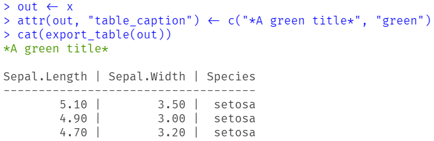

# Exporting tables with captions and footers

## Exporting data frames into nice tables

The
[`export_table()`](https://easystats.github.io/insight/reference/export_table.md)
functions creates nicely formatted tables in text, markdown or HTML
format. You can add (coloured) captions or footer lines to the table as
well, and you can even create multiple tables from a *list* of data
frames.

This vignette shows some examples how to do this (focusing on text
output). Note that
[`export_table()`](https://easystats.github.io/insight/reference/export_table.md)
returns a *formatted string*, which prints nicely (which essentially
just uses [`cat()`](https://rdrr.io/r/base/cat.html)).

***Note:*** The vignettes includes example with coloured text output.
The coloured text is not rendered in this vignette. Rather, try out
these examples and look at the results in your console!

``` r

library(insight)
x <- iris[1:3, c(1, 2, 5)]

# the table as "readable" output
export_table(x)
#> Sepal.Length | Sepal.Width | Species
#> ------------------------------------
#>         5.10 |        3.50 |  setosa
#>         4.90 |        3.00 |  setosa
#>         4.70 |        3.20 |  setosa

# see the underlying string
unclass(export_table(x))
#> [1] "Sepal.Length | Sepal.Width | Species\n------------------------------------\n        5.10 |        3.50 |  setosa\n        4.90 |        3.00 |  setosa\n        4.70 |        3.20 |  setosa\n"
```

## Adding (coloured) titles

A title can be added by either using the `caption` argument, or by
adding a string as `table_caption` attribute.

``` r

# a simple caption
export_table(x, caption = "Title")
#> Title
#> 
#> Sepal.Length | Sepal.Width | Species
#> ------------------------------------
#>         5.10 |        3.50 |  setosa
#>         4.90 |        3.00 |  setosa
#>         4.70 |        3.20 |  setosa

# we use a new object, so "x" has no attributes yet
out <- x
attr(out, "table_caption") <- "Another title"
export_table(out)
#> Another title
#> 
#> Sepal.Length | Sepal.Width | Species
#> ------------------------------------
#>         5.10 |        3.50 |  setosa
#>         4.90 |        3.00 |  setosa
#>         4.70 |        3.20 |  setosa
```

`caption` can also be character vector of length 2, with the first
element being the caption, and the second being the name of a colour
(see
[`?print_colour`](https://easystats.github.io/insight/reference/print_color.md)
for available options). This is helpful for printing coloured table
captions.

``` r

# A red caption
export_table(x, caption = c("# Title", "red"))
#> # Title
#> 
#> Sepal.Length | Sepal.Width | Species
#> ------------------------------------
#>         5.10 |        3.50 |  setosa
#>         4.90 |        3.00 |  setosa
#>         4.70 |        3.20 |  setosa

# same for attribute
out <- x
attr(out, "table_caption") <- c("*A green title*", "green")
export_table(out)
#> *A green title*
#> 
#> Sepal.Length | Sepal.Width | Species
#> ------------------------------------
#>         5.10 |        3.50 |  setosa
#>         4.90 |        3.00 |  setosa
#>         4.70 |        3.20 |  setosa
```

Since the coloured text is not rendered, we provide a screenshot as
example here:



## Adding (coloured) table footers

Use the `footer` argument to add a footer line to the table. It is also
possible to add a string as `table_footer` attribute.

``` r

# colored caption, simple footer
export_table(
  x,
  caption = c("# Title", "red"),
  footer = "Footer line"
)
#> # Title
#> 
#> Sepal.Length | Sepal.Width | Species
#> ------------------------------------
#>         5.10 |        3.50 |  setosa
#>         4.90 |        3.00 |  setosa
#>         4.70 |        3.20 |  setosa
#> Footer line

# as attribute
out <- x
attr(out, "table_caption") <- c("*A green title*", "green")
attr(out, "table_footer") <- "A simple footer"
export_table(out)
#> *A green title*
#> 
#> Sepal.Length | Sepal.Width | Species
#> ------------------------------------
#>         5.10 |        3.50 |  setosa
#>         4.90 |        3.00 |  setosa
#>         4.70 |        3.20 |  setosa
#> A simple footer
```

Coloured footers can be added in the same way as for captions.

``` r

# colored caption and footer
export_table(
  x,
  caption = c("# Title", "red"),
  footer = c("Footer line in blue", "blue")
)
#> # Title
#> 
#> Sepal.Length | Sepal.Width | Species
#> ------------------------------------
#>         5.10 |        3.50 |  setosa
#>         4.90 |        3.00 |  setosa
#>         4.70 |        3.20 |  setosa
#> Footer line in blue

# as attribute
out <- x
attr(out, "table_caption") <- c("*A green title*", "green")
attr(out, "table_footer") <- c("Footer line in blue", "blue")
export_table(out)
#> *A green title*
#> 
#> Sepal.Length | Sepal.Width | Species
#> ------------------------------------
#>         5.10 |        3.50 |  setosa
#>         4.90 |        3.00 |  setosa
#>         4.70 |        3.20 |  setosa
#> Footer line in blue
```

## Adding subtitles

Subtitles can be added using the `subtitle` argument, or the
`table_subtitle` attribute. Note that you must take care of adding
new-line characters.

``` r

# colored caption, subtitle and footer
export_table(
  x,
  caption = c("# Title", "red"),
  subtitle = c("\n   A subtitle in yellow", "yellow"),
  footer = c("Footer line in blue", "blue")
)
#> # Title 
#>   A subtitle in yellow
#> 
#> Sepal.Length | Sepal.Width | Species
#> ------------------------------------
#>         5.10 |        3.50 |  setosa
#>         4.90 |        3.00 |  setosa
#>         4.70 |        3.20 |  setosa
#> Footer line in blue

# as attribute
out <- x
attr(out, "table_caption") <- c("*A green title*", "green")
attr(out, "table_subtitle") <- c("\nA yellow subtitle", "yellow")
attr(out, "table_footer") <- c("Footer line in blue", "blue")
export_table(out)
#> *A green title* 
#> A yellow subtitle
#> 
#> Sepal.Length | Sepal.Width | Species
#> ------------------------------------
#>         5.10 |        3.50 |  setosa
#>         4.90 |        3.00 |  setosa
#>         4.70 |        3.20 |  setosa
#> Footer line in blue
```

## Exporting multiple data frames into multiple tables

Multiple data frames saved in a
[`list()`](https://rdrr.io/r/base/list.html) can be used to create
multiple tables at once.

``` r

x <- list(
  data.frame(iris[1:3, c(1, 2, 5)]),
  data.frame(iris[51:53, c(1, 3, 5)]),
  data.frame(iris[111:113, c(1, 4, 5)])
)

# three different tables
export_table(x)
#> Sepal.Length | Sepal.Width | Species
#> ------------------------------------
#>         5.10 |        3.50 |  setosa
#>         4.90 |        3.00 |  setosa
#>         4.70 |        3.20 |  setosa
#> 
#> Sepal.Length | Petal.Length |    Species
#> ----------------------------------------
#>         7.00 |         4.70 | versicolor
#>         6.40 |         4.50 | versicolor
#>         6.90 |         4.90 | versicolor
#> 
#> Sepal.Length | Petal.Width |   Species
#> --------------------------------------
#>         6.50 |        2.00 | virginica
#>         6.40 |        1.90 | virginica
#>         6.80 |        2.10 | virginica
```

## Adding table captions and footers

For multiple tables, it is also possible to add a caption for each
table. Simply use a [`list()`](https://rdrr.io/r/base/list.html) of
strings for the `caption` argument, or add a `table_caption` attribute.
to *each* data frame in the list.

``` r

# one caption for each table
export_table(x, caption = list("Table 1", "Table 2", "Table 3"))
#> Table 1
#> 
#> Sepal.Length | Sepal.Width | Species
#> ------------------------------------
#>         5.10 |        3.50 |  setosa
#>         4.90 |        3.00 |  setosa
#>         4.70 |        3.20 |  setosa
#> 
#> Table 2
#> 
#> Sepal.Length | Petal.Length |    Species
#> ----------------------------------------
#>         7.00 |         4.70 | versicolor
#>         6.40 |         4.50 | versicolor
#>         6.90 |         4.90 | versicolor
#> 
#> Table 3
#> 
#> Sepal.Length | Petal.Width |   Species
#> --------------------------------------
#>         6.50 |        2.00 | virginica
#>         6.40 |        1.90 | virginica
#>         6.80 |        2.10 | virginica

# add attribute to *each* data frame
out <- x
for (i in seq_along(out)) {
  attr(out[[i]], "table_caption") <- paste("Table", i)
}
export_table(out)
#> Table 1
#> 
#> Sepal.Length | Sepal.Width | Species
#> ------------------------------------
#>         5.10 |        3.50 |  setosa
#>         4.90 |        3.00 |  setosa
#>         4.70 |        3.20 |  setosa
#> 
#> Table 2
#> 
#> Sepal.Length | Petal.Length |    Species
#> ----------------------------------------
#>         7.00 |         4.70 | versicolor
#>         6.40 |         4.50 | versicolor
#>         6.90 |         4.90 | versicolor
#> 
#> Table 3
#> 
#> Sepal.Length | Petal.Width |   Species
#> --------------------------------------
#>         6.50 |        2.00 | virginica
#>         6.40 |        1.90 | virginica
#>         6.80 |        2.10 | virginica
```

In the same way you can add multiple footers. Note, however, that you
have to take care about adding new-line characters.

``` r

# add captions and footers for each table
export_table(
  x,
  caption = list("Table 1", "Table 2", "Table 3"),
  footer = list("Footer 1\n\n", "Footer 2\n\n", "Footer 3\n\n")
)
#> Table 1
#> 
#> Sepal.Length | Sepal.Width | Species
#> ------------------------------------
#>         5.10 |        3.50 |  setosa
#>         4.90 |        3.00 |  setosa
#>         4.70 |        3.20 |  setosa
#> Footer 1
#> 
#> 
#> Table 2
#> 
#> Sepal.Length | Petal.Length |    Species
#> ----------------------------------------
#>         7.00 |         4.70 | versicolor
#>         6.40 |         4.50 | versicolor
#>         6.90 |         4.90 | versicolor
#> Footer 2
#> 
#> 
#> Table 3
#> 
#> Sepal.Length | Petal.Width |   Species
#> --------------------------------------
#>         6.50 |        2.00 | virginica
#>         6.40 |        1.90 | virginica
#>         6.80 |        2.10 | virginica
#> Footer 3

out <- x
for (i in seq_along(out)) {
  attr(out[[i]], "table_caption") <- paste("Table", i)
  attr(out[[i]], "table_footer") <- paste("Footer", i, "\n\n")
}
export_table(out)
#> Table 1
#> 
#> Sepal.Length | Sepal.Width | Species
#> ------------------------------------
#>         5.10 |        3.50 |  setosa
#>         4.90 |        3.00 |  setosa
#>         4.70 |        3.20 |  setosa
#> Footer 1 
#> 
#> 
#> Table 2
#> 
#> Sepal.Length | Petal.Length |    Species
#> ----------------------------------------
#>         7.00 |         4.70 | versicolor
#>         6.40 |         4.50 | versicolor
#>         6.90 |         4.90 | versicolor
#> Footer 2 
#> 
#> 
#> Table 3
#> 
#> Sepal.Length | Petal.Width |   Species
#> --------------------------------------
#>         6.50 |        2.00 | virginica
#>         6.40 |        1.90 | virginica
#>         6.80 |        2.10 | virginica
#> Footer 3
```

Finally, you can even add multiple footer lines to each table, giving
each a different color. In this case, each list element has to be a
character vector of length 2 (the first element being the caption, and
the second being the name of a colour).

``` r

# Colored table captions and multiple footers per table
export_table(
  x,
  caption = list(
    c("Red Table 1", "red"),
    c("Blue Table 2", "blue"),
    c("Green Table 3", "green")
  ),
  footer = list(
    list(c("Footer line 1\n", "green"), c("Second line\n\n", "red")),
    list(c("Footer line A\n", "blue"), c("Second line\n\n", "green")),
    list(c("Footer line I\n", "yellow"), c("Second line\n\n", "blue"))
  )
)
#> Red Table 1
#> 
#> Sepal.Length | Sepal.Width | Species
#> ------------------------------------
#>         5.10 |        3.50 |  setosa
#>         4.90 |        3.00 |  setosa
#>         4.70 |        3.20 |  setosa
#> Footer line 1
#> Second line
#> 
#> 
#> Blue Table 2
#> 
#> Sepal.Length | Petal.Length |    Species
#> ----------------------------------------
#>         7.00 |         4.70 | versicolor
#>         6.40 |         4.50 | versicolor
#>         6.90 |         4.90 | versicolor
#> Footer line A
#> Second line
#> 
#> 
#> Green Table 3
#> 
#> Sepal.Length | Petal.Width |   Species
#> --------------------------------------
#>         6.50 |        2.00 | virginica
#>         6.40 |        1.90 | virginica
#>         6.80 |        2.10 | virginica
#> Footer line I
#> Second line
```

## Splitting one long table into multiple tables

When the table is wider than the current width (i.e. line length) of the
console (or any other source for textual output, like markdown files),
the table can be split into multiple parts to fit the width of the
screen using the `table_width` argument. This is set to `"auto"` by
default, i.e. by default tables are always adjusted to fit into the
current display.

We’ll demonstrate this using a codebook of a dataset from the
*datawizard* package.

``` r

data(efc, package = "datawizard")
# prepare a data set, in this example a codebook of the EFC dataset
out <- datawizard::data_codebook(efc[, 1:3])
out$.row_id <- NULL

export_table(
  out,
  table_width = 70, # fix width to 70 chars
  empty_line = "-", # empty lines (separator rows) indicated by "-"
  cross = "+" # use "+" where vertical and horizontal table lines cross
)
#> ID |    Name |                                    Label |        Type
#> ---+---------+------------------------------------------+------------
#> 1  | c12hour | average number of hours of care per week |     numeric
#> ---+---------+------------------------------------------+------------
#> 2  |  e16sex |                           elder's gender |     numeric
#>    |         |                                          |            
#> ---+---------+------------------------------------------+------------
#> 3  |  e42dep |                       elder's dependency | categorical
#>    |         |                                          |            
#>    |         |                                          |            
#>    |         |                                          |            
#> ---------------------------------------------------------------------
#> 
#> ID | Missings |   Values |         Value Labels |  N |  Prop
#> ---+----------+----------+----------------------+----+------
#> 1  | 2 (2.0%) | [5, 168] |                      | 98 |      
#> ---+----------+----------+----------------------+----+------
#> 2  | 0 (0.0%) |        1 |                 male | 46 | 46.0%
#>    |          |        2 |               female | 54 | 54.0%
#> ---+----------+----------+----------------------+----+------
#> 3  | 3 (3.0%) |        1 |          independent |  2 |  2.1%
#>    |          |        2 |   slightly dependent |  4 |  4.1%
#>    |          |        3 | moderately dependent | 28 | 28.9%
#>    |          |        4 |   severely dependent | 63 | 64.9%
#> ------------------------------------------------------------
```

As you can see, the third row in the first table part contains some
empty rows. This is because the height of the tables are always the same
by default, to avoid confusion. However, it is also possible to remove
redundant empty rows, using the `remove_duplicates` argument.

``` r

export_table(
  out,
  table_width = 70,
  empty_line = "-",
  cross = "+",
  remove_duplicates = TRUE
)
#> ID |    Name |                                    Label |        Type
#> ---+---------+------------------------------------------+------------
#> 1  | c12hour | average number of hours of care per week |     numeric
#> ---+---------+------------------------------------------+------------
#> 2  |  e16sex |                           elder's gender |     numeric
#> ---+---------+------------------------------------------+------------
#> 3  |  e42dep |                       elder's dependency | categorical
#> ---------------------------------------------------------------------
#> 
#> ID | Missings |   Values |         Value Labels |  N |  Prop
#> ---+----------+----------+----------------------+----+------
#> 1  | 2 (2.0%) | [5, 168] |                      | 98 |      
#> ---+----------+----------+----------------------+----+------
#> 2  | 0 (0.0%) |        1 |                 male | 46 | 46.0%
#>    |          |        2 |               female | 54 | 54.0%
#> ---+----------+----------+----------------------+----+------
#> 3  | 3 (3.0%) |        1 |          independent |  2 |  2.1%
#>    |          |        2 |   slightly dependent |  4 |  4.1%
#>    |          |        3 | moderately dependent | 28 | 28.9%
#>    |          |        4 |   severely dependent | 63 | 64.9%
#> ------------------------------------------------------------
```
