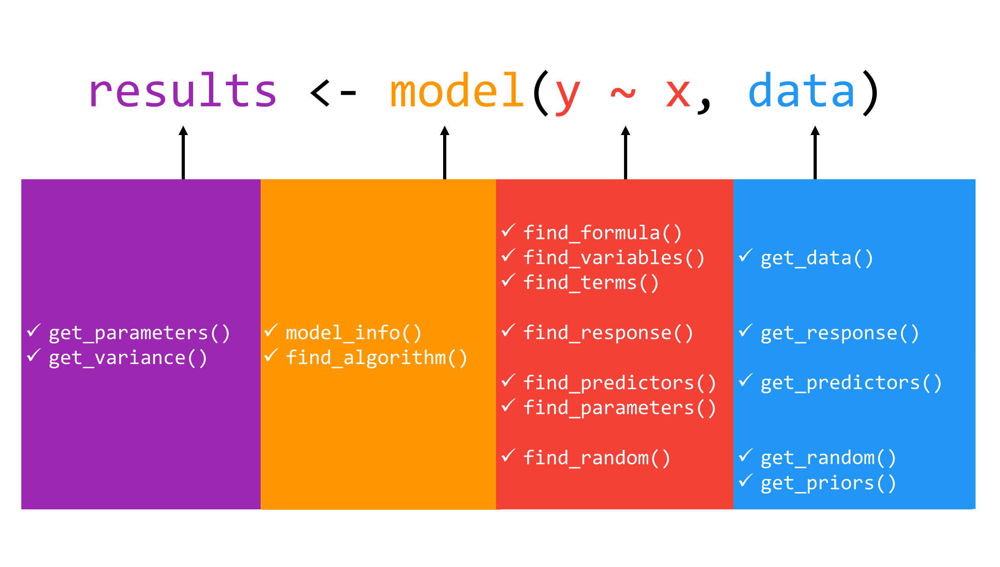
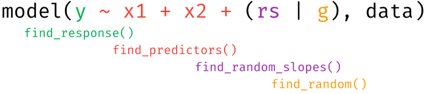

# Summary

When fitting any statistical model, there are many useful pieces of information that are simultaneously calculated and stored beyond coefficient estimates and general model fit statistics. Although there exist some generic functions to obtain model information and data, many package-specific modeling functions do not provide such methods to allow users to access such valuable information. 

*insight* is an R-package [@rcore] that fills this important gap by providing a suite of functions to support almost any model (see a list of the many models supported below in the **Supported Models** section). The goal of *insight*, then, is to provide tools to provide *easy*, *intuitive*, and *consistent* access to information contained in model objects. These tools aid applied research in virtually any field who fit, diagnose, and present statistical models by streamlining access to every aspect of many model objects via consistent syntax and output.

Ultimately, the development of *insight* is in line with the philosophy of the [easystats project](https://github.com/easystats), which is to facilitate and streamline the process of running statistical analysis, interpreting and reporting the results in the R programming language. 

## Getting Up and Running with *insight*

Built with non-programmers in mind, *insight* offers a broad toolbox for making model and data information easily accessible. While *insight* offers many useful functions for working with and understanding model objects (discussed below), we suggest users start with `model_info()`, as this function provides a clean and consistent overview of model objects (e.g., functional form of the model, the model family, link function, number of observations, variables included in the specification, etc.). With a clear understanding of the model introduced, users are able to adapt other functions for more nuanced exploration of and interaction with virtually any model object. 

Thus, building on this starting place, the remainder of the package revolves around two key prefixes: `get_*` and `find_*`. The `get_*` prefix extracts *values* (or *data*) associated with model-specific objects (e.g., parameters or variables), while the `find_*` prefix *lists* model-specific objects (e.g., priors or predictors). These are powerful families of functions allowing for great flexibility in use, whether at a high, descriptive level (`find_*`) or narrower level of statistical inspection and reporting (`get_*`).

\pagebreak

In total, the *insight* package includes 16 core functions (see Figure 1): `get_data()`, `get_priors()`, `get_variance()`, `get_parameters()`, `get_predictors()`, `get_random()`, `get_response()`, `find_algorithm()`, `find_formula()`, `find_variables()`, `find_terms()`, `find_parameters()`, `find_predictors()`, `find_random()`, `find_response()`, and `model_info()`. In all cases, users must supply at a minimum, the name of the fitted model object. In several functions, there are additional arguments that allow for more targeted returns of model information. For example, the `find_terms()` function's `effects` argument allows for the extraction of "fixed effects" terms, "random effects" terms, or by default, "all" terms in the model object. We point users to the package documentation or the complementary package website, https://easystats.github.io/insight/, for a detailed list of the arguments associated with each function as well as the returned values from each function.



\pagebreak

## Definition of Model Components

The functions from *insight* address different components of a model. In an effort to avoid confusion about specific "targets" of each function, in this section we provide a short explanation of *insight*'s definitions of regression model components (see Figures 2 and 3). For detailed examples, we point users to the [accompanying package website](https://easystats.github.io/insight/articles/insight.html).

* **data**: the dataset used to fit the model.
* **response**: the outcome or response variable (dependent variable) of a regression model.
* **predictors**: independent variables of (the _fixed_ part of) a regression model. For mixed models, variables that are only in the _random effects_ part (i.e. grouping factors) of the model are not returned as predictors by default. However, these can be included using additional arguments in the function call, treating predictors are "unqiue." As such, if a variable appears as a fixed effect and a random slope, it is treated as one (the same) predictor.
* **random slopes**: variables that are specified as random slopes in a mixed effects model.
* **random or grouping factors**: variables that are specified as grouping variables in a mixed effects model.
* **parameters**: values estimated or learned from data that capture the relationship between variables. In regression models, these are usually referred to as *coefficients*.



\pagebreak

* **terms**: any unique variables that appear in a regression model, e.g., response variables, predictors or random effects. A "term" only relates to the unique occurence of a variable. For instance, the expression `x + poly(x, 2)` has only the term `x`.
* **variables**: an object that stores unique data information. For instance, the expression `x + poly(x, 2)` has two objects with two different sets of data values, and thus are treated as two variables.


## Examples

For a more intuitive introduction, consider the following examples for three major types of models: ordinary least squares (OLS) regression, linear mixed effects models, and Bayesian models. Importantly, though only a few functions are included below for the sake of space, users are encouraged to inspect the package documentation for an exhaustive list of package functionality with accompanying examples.

```{R}
# Load the "insight" package
install.packages("insight")
library(insight)

# Sample model 1: OLS
sample1 <- lm(mpg ~ cyl + wt + hp, data = mtcars)

get_parameters(sample1)
#>     parameter   estimate
#> 1 (Intercept) 38.7517874
#> 2         cyl -0.9416168
#> 3          wt -3.1669731
#> 4          hp -0.0180381

find_algorithm(sample1)
#> $algorithm
#> [1] "OLS"

find_formula(sample1)
#> $conditional
#> mpg ~ cyl + wt + hp


# Sample model 2: Linear Mixed Effects (via lme4)
sample2 <- lme4::lmer(
  Reaction ~ Days + (Days | Subject), 
  data = sleepstudy
)

get_parameters(sample2)
#>     parameter  estimate
#> 1 (Intercept) 251.40510
#> 2        Days  10.46729

find_algorithm(sample2)
#> $algorithm
#> [1] "REML"
#> 
#> $optimizer
#> [1] "nloptwrap"

find_formula(sample2)
#> $conditional
#> Reaction ~ Days
#> 
#> $random
#> ~Days | Subject


# Sample model 3: Bayesian (via rstanarm)
sample3 <- rstanarm::stan_glm(
  Sepal.Width ~ Species * Petal.Length, 
  data = iris
)

get_priors(sample3)
#>                        parameter distribution location scale
#> 1                    (Intercept)       normal        0  10.0
#> 2              Speciesversicolor       normal        0   2.5
#> 3               Speciesvirginica       normal        0   2.5
#> 4                   Petal.Length       normal        0   2.5
#> 5 Speciesversicolor:Petal.Length       normal        0   2.5
#> 6  Speciesvirginica:Petal.Length       normal        0   2.5

find_algorithm(sample3)
#> $algorithm
#> [1] "sampling"
#> 
#> $chains
#> [1] 4
#> 
#> $iterations
#> [1] 2000
#> 
#> $warmup
#> [1] 1000

find_formula(sample3)
#> $conditional
#> Sepal.Width ~ Species * Petal.Length
```

## Examples of Use Cases in R Packages

*insight* is already used by different packages to solve problems that typically occur when the users' inputs are different model objects of varying complexity.

For example, *ggeffects* [@ludecke_ggeffects_2018], a package that computes and visualizes marginal effects of regression models, requires extraction of the data (`get_data()`) that was used to fit the models, and also the retrieval all model predictors (`find_predictors()`) to decide which covariates are held constant when computing marginal effects. All of this information is required in order to create a data frame for `predict(newdata=<data frame>)`. Furthermore, the models' link-functions (`link_function()`) resp. link-inverse-functions (`link_inverse()`) are required to obtain predictons at the model's response scale.

The *sjPlot*-package [@pkg_sjPlot] creates plots or summary tables from regression models, and uses *insight*-functions to get model-information (`model_info()` or `find_response()`), which is used to build the components of the final plot or table. This information helps, for example, in labeling table columns by providing information on the effect type (odds ratio, incidence rate ratio, etc.) or the different model components, which split plots and tables into the "conditional" and "zero-inflated" parts of a model, in the cases of models with zero-inflation.

*bayestestR* [@pkg_bayestestR] mainly relies on `get_priors()` and `get_parameters()` to retrieve the necessary information to compute various indices or statistics of Bayesian models (like HDI, Credible Interval, MCSE, effective sample size, Bayes factors, etc.). The advantage of `get_parameters()` in this context is that regardless of the number of parameters the posterior distribution has, the necessary data can be easily accessed from the model objects. There is no need to write original, complicated code or regular expressions.

A last example is the *performance*-package [@pkg_performance], which provides functions for computing measures to assess model quality. Many of these indices (e.g. check for overdispersion or zero-inflation, predictive accuracy, logloss, RMSE, etc.) require the number of observations (`n_obs()`) or the data from the response-variable (`get_response()`). Again, in this context, functions from *insight* are helpful, because they offer a unified access to this information.

## Supported Models

*insight* works with many different model-objects (from various packages), such as **AER** (*ivreg, tobit*), **afex** (*mixed*), **aod** (*betabin, negbin*), **base** (*aov, aovlist, lm, glm*), **BayesFactor** (*BFBayesFactor*), **betareg** (*betareg*), **biglm** (*biglm, bigglm*), **blme** (*blmer, bglmer*), **brms** (*brmsfit*), **censReg**, **crch**, **countreg** (*zerontrunc*), **coxme**, **estimatr** (*lm_robust, iv_robust*), **feisr** (*feis*), **gam** (*Gam*), **gamm4** , **gamlss**, **gbm**, **gee**, **geepack** (*geeglm*), **GLMMadaptive** (*MixMod*), **glmmTMB** (*glmmTMB*), **gmnl**,  **HRQoL** (*BBreg*, *BBmm*), **lfe** (*felm*), **lme4** (*lmer, glmer, nlmer, glmer.nb*), **MASS** (*glmmPQL, polr*), **mgcv** (*gam, gamm*), **multgee** (*LORgee*), **nnet** (*multinom*), **nlme** (*lme, gls*), **ordinal** (*clm, clm2, clmm*), **panelr** (*wbm*), **plm**, **pscl** (*zeroinf, hurdle*), **quantreg** (*rq, crq, rqss*), **rms** (*lsr, ols, psm*), **robust** (*glmRob, lmRob*), **robustbase** (*glmrob, lmrob*), **robustlmm** (*rlmer*), **rstanarm** (*stanreg, stanmvreg*), **speedlm** (*speedlm, speedglm*), **survey**, **survival** (*coxph, survreg*), **truncreg** (*truncreg*), **VGAM** (*vgam, vglm*), and more.

## Licensing and Package Access

*insight* is licensed under the GNU General Public License (v3.0), with all source code stored at GitHub (https://github.com/easystats/insight), with a corresponding issue tracker for bug-reporting and feature enhancements. In the spirit of open science and research, we encourage interaction with our package through requests/tips for fixes, support for additional model objects, feature updates, as well as general questions and concerns via direct interaction with contributors and developers.

# References
