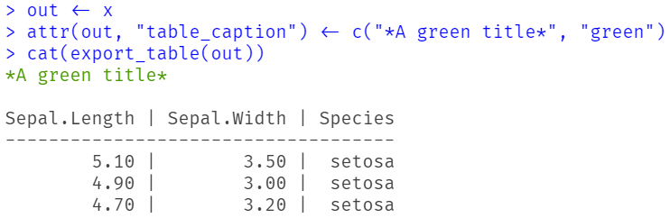

```{r, include = FALSE}
knitr::opts_chunk$set(
  collapse = TRUE,
  comment = "#>",
  warning = FALSE,
  message = FALSE
)
```

## Exporting data frames into nice tables

The `export_table()` functions creates nicely formatted tables in text, markdown or HTML format. You can add (coloured) captions or footer lines to the table as well, and you can even create multiple tables from a *list* of data frames.

This vignette shows some examples how to do this (focusing on text output). Note that `export_table()` returns a *formatted string*. To print the formatted table, you must also use `cat()`.

***Note:*** The vignettes includes example with coloured text output. The coloured text is not rendered in this vignette. Rather, try out these examples and look at the results in your console!

```{r}
library(insight)
x <- data.frame(iris[1:3, c(1, 2, 5)])

# just the string
export_table(x)

# the table as "readable" output
cat(export_table(x))
```

## Adding (coloured) titles

A title can be added by either using the `caption` argument, or by adding a string as `table_caption` attribute.

```{r}
# a simple caption
cat(export_table(x, caption = "Title"))

# we use a new object, so "x" has no attributes yet
out <- x
attr(out, "table_caption") <- "Another title"
cat(export_table(out))
```

`caption` can also be character vector of length 2, with the first element being the caption, and the second being the name of a colour (see `?print_colour` for available options). This is helpful for printing coloured table captions.

```{r}
# A red caption
cat(export_table(x, caption = c("# Title", "red")))

# same for attribute
out <- x
attr(out, "table_caption") <- c("*A green title*", "green")
cat(export_table(out))
```

Since the coloured text is not rendered, we provide a screenshot as example here:

```{r echo=FALSE}

```


## Adding (coloured) table footers

Use the `footer` argument to add a footer line to the table. It is also possible to add a string as `table_footer` attribute. 

```{r}
# colored caption, simple footer
cat(export_table(
  x, 
  caption = c("# Title", "red"),
  footer = "Footer line"
))

# as attribute
out <- x
attr(out, "table_caption") <- c("*A green title*", "green")
attr(out, "table_footer") <- "A simple footer"
cat(export_table(out))
```

Coloured footers can be added in the same way as for captions.

```{r}
# colored caption and footer
cat(export_table(
  x, 
  caption = c("# Title", "red"),
  footer = c("Footer line in blue", "blue")
))

# as attribute
out <- x
attr(out, "table_caption") <- c("*A green title*", "green")
attr(out, "table_footer") <- c("Footer line in blue", "blue")
cat(export_table(out))
```

## Adding subtitles

Subtitles can be added using the `subtitle` argument, or the `table_subtitle` attribute. Note that you must take care of adding new-line characters.

```{r}
# colored caption, subtitle and footer
cat(export_table(
  x, 
  caption = c("# Title", "red"),
  subtitle = c("\n   A subtitle in yellow", "yellow"),
  footer = c("Footer line in blue", "blue")
))

# as attribute
out <- x
attr(out, "table_caption") <- c("*A green title*", "green")
attr(out, "table_subtitle") <- c("\nA yellow subtitle", "yellow")
attr(out, "table_footer") <- c("Footer line in blue", "blue")
cat(export_table(out))
```

## Exporting multiple data frames into multiple tables

Multiple data frames saved in a `list()` can be used to create multiple tables at once.

```{r}
x <- list(
  data.frame(iris[1:3, c(1, 2, 5)]),
  data.frame(iris[51:53, c(1, 3, 5)]),
  data.frame(iris[111:113, c(1, 4, 5)])
)

# three different tables
cat(export_table(x))
```

## Adding table captions and footers

For multiple tables, it is also possible to add a caption for each table. Simply use a `list()` of strings for the `caption` argument, or add a `table_caption` attribute. to *each* data frame in the list.

```{r}
# one caption for each table
cat(export_table(x, caption = list("Table 1", "Table 2", "Table 3")))

# add attribute to *each* data frame
out <- x
for (i in 1:length(out)) {
  attr(out[[i]], "table_caption") <- paste("Table", i)
}
cat(export_table(out))
```

In the same way you can add multiple footers. Note, however, that you have to take care about adding new-line characters.

```{r}
# add captions and footers for each table
cat(export_table(
  x, 
  caption = list("Table 1", "Table 2", "Table 3"),
  footer = list("Footer 1\n\n", "Footer 2\n\n", "Footer 3\n\n")
))

out <- x
for (i in 1:length(out)) {
  attr(out[[i]], "table_caption") <- paste("Table", i)
  attr(out[[i]], "table_footer") <- paste("Footer", i, "\n\n")
}
cat(export_table(out))
```

Finally, you can even add multiple footer lines to each table, giving each a different color. In this case, each list element has to be a character vector of length 2 (the first element being the caption, and the second being the name of a colour).

```{r}
# Colored table captions and multiple footers per table
cat(export_table(
  x, 
  caption = list(c("Red Table 1", "red"),
                 c("Blue Table 2", "bue"),
                 c("Green Table 3", "green")),
  footer = list(
    list(c("Footer line 1\n", "green"), c("Second line\n\n", "red")),
    list(c("Footer line A\n", "blue"), c("Second line\n\n", "green")),
    list(c("Footer line I\n", "yellow"), c("Second line\n\n", "blue"))
  )
))
```
